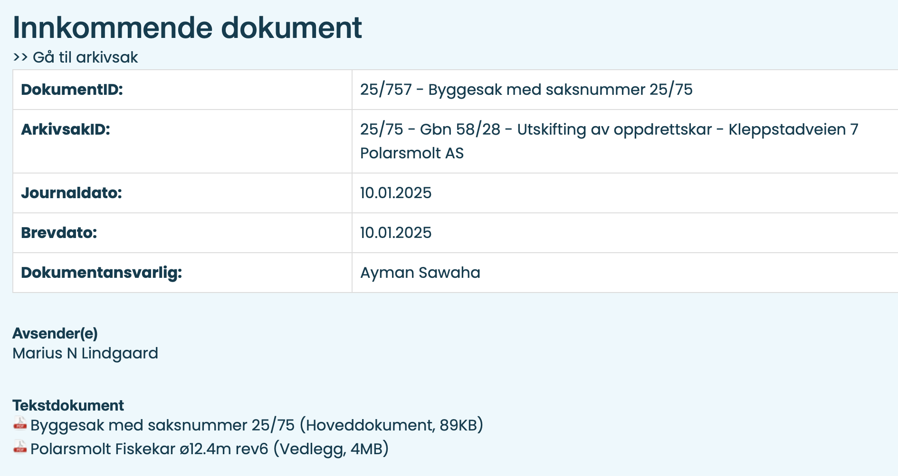

# kommune

Et Python-script som henter alt fra disse kommunenes postlister:
* Vågan kommune: https://vagan.kommune.no/politikk-og-organisasjon/innsyn/postliste/
* Vestvågøy kommune: https://www.vestvagoy.kommune.no/innsyn.aspx
* Flakstad: https://flakstad.kommune.no/innsyn.aspx
* Moskenes: https://moskenes.kommune.no/innsyn.aspx

Siden søkefunksjonen for postlistene krever at man først velger _datoen_ man vil søke i, fungerer de dårlig.

Med dette scriptet får du alt innhold lokalt, og kan søke i det uavhengig av dato.
Det er _mulig_ det kommer mer funksjonalitet.

## Nettsidene

Startsidene er som dette: https://vagan.kommune.no/politikk-og-organisasjon/innsyn/postliste/

Postlistene har én oversiktsside per dag, og URL-en inneholder datoen på formatet `fradato=2025-01-10`:
https://vagan.kommune.no/innsyn.aspx?response=journalpost_postliste&MId1=731&scripturi=/innsyn.aspx&skin=infolink&fradato=2025-01-10T00:00:00

Hver sak har en URL tilsvarende denne:
https://vagan.kommune.no/innsyn.aspx?response=journalpost_detaljer&journalpostid=2021113411&scripturi=/innsyn.aspx&skin=infolink&Mid1=731&

Sakene presenteres som dette:


## Bruk

Installer pakkene scriptet bruker:
`pip install -r requirements.txt`.

Start scriptet med ønsket kommune, startdato og sluttdato, f.eks:
* `python download.py vagan 2024-01-01 2024-12-31` 
* `python download.py vestvagoy 2025-01-01 2025-01-15`

## Data som lagres

For hver sak lagres filer som dette:
```
$ ls -1 "archive-vagan/2025/01/10/2021113419 25_75 - Gbn 58_28 - Utskifting av oppdrettskar - Kleppstadveien 7 Polarsmolt AS"
Byggesak med saksnummer 25_75.pdf
Polarsmolt Fiskekar ø12.4m rev6.pdf
details.txt
```

Filen `details.txt` inneholder litt info om saken:

```
$ cat "archive-vagan/2025/01/10/2021113419 25_75 - Gbn 58_28 - Utskifting av oppdrettskar - Kleppstadveien 7 Polarsmolt AS/details.txt"
DokumentID: 25/757 - Byggesak med saksnummer 25/75
ArkivsakID: 25/75 - Gbn 58/28 - Utskifting av oppdrettskar - Kleppstadveien 7 Polarsmolt AS
Journaldato: 10.01.2025
Brevdato: 10.01.2025
Dokumentansvarlig: Ayman Sawaha

Avsender(e):
Marius N Lindgaard

Byggesak med saksnummer 25_75.pdf
Polarsmolt Fiskekar ø12.4m rev6.pdf
```

## Logging

```
$ python ./download.py -f vagan 2025-01-10 2025-01-10
2025-01-10
  2021113333: 22/682 - Feil ved begjæring om tvangsfullbyrdelse
  2021113335: 24/1742 - Eierskapsenheten - Leie av kommunal bolig
  2021113419: 25/75 - Gbn 58/28 - Utskifting av oppdrettskar - Kleppstadveien 7 Polarsmolt AS
    - Byggesak med saksnummer 25_75.pdf
    - Polarsmolt Fiskekar ø12.4m rev6.pdf
  2021113448: 25/95 - Gbn 10/27 og 10/101 - egenerklæring om konsesjonsfrihet
    - Egenerklæring.pdf
  2021113411: 22/3478 - Gbn 18/146 - Tørrfisktørkeri - Kløfterholmveien 10, Svolvær Saga Fisk As
    - Ferdigstillelse av tiltak på gnr. 18 bnr. 146.pdf
    - Tillatelse til tiltak - branntekniske sikringstiltak - gbn 18146 Kløfterholmveien 10 Svolvær (2).pdf
```    

Det første tallet (`2021113333` o.l.) er hentet fra `journalpostid=2021113333` i URL-en til saken.

## Greit å vite

* Mellom hver dag tar scriptet en pause på 0-5 sekunder.
* Hvis en saksmappe (directory) allerede eksisterer, hopper scriptet over den saken.
  Det kan overstyres med `-f`, som dette: `download.py -f vagan 2024-01-01 2024-12-31`.


